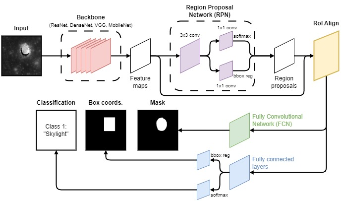
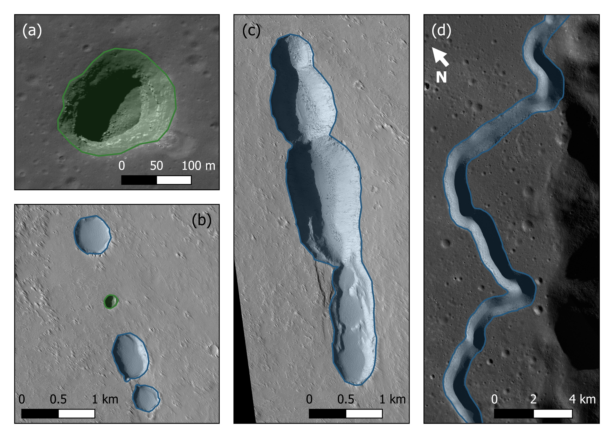

# ESSA (Entrances to Sub-Surface Areas) - Detecting Pits and Skylights on the Moon Using Deep Learning

## Introduction

Pits and skylights are circular-to-elliptical, rimless, steep-sided depressions in planetary surfaces formed via gravitational collapse - which are of interest for astrobiological investigation and future space exploration. This is due to their ability to signify the presence of, or allow access to (in the case of skylights), underground cave systems such as lava tubes.

Whilst the Lunar Pit Atlas (Wagner & Robinson 2021) contains 16 such features situated within mare regions, these were partly discovered via an automated tool which was limited by searchable latitudes and data coverage. In order to search for previously uncatalogued features, we have trained a Deep Learning model on different combinations of Lunar and Martian remote-sensing imagery to detect pits and skylights on the Moon. This model, named ESSA (Entrances to Sub-Surface Areas), has been tested upon imagery of the famous Mare Tranquillitatis Pit (MTP) and self-produced mosaics of proposed lava tube collapses (Sauro et al. 2020). It has also searched for uncatalogued pits and skylights within eight mare deposits on the Moon.

## What is ESSA?

ESSA, which was also named after the Cornish (*Kernowek*) name for the author's home-town of Saltash, Cornwall (*"Essa"*), is a Mask Region-based Convolutional Neural Network (R-CNN; He et al. 2017; see **Figure 1**). ESSA in particular is a Mask R-CNN trained with a ResNet50 backbone and a Feature Pyramid Network (FPN). R-CNNs are a series of Deep Convolutional Neural Networks (DCNNs) which first perform object detection by proposing several regions of interest that are likely to contain target features and feeding these through a neural network for detection. Mask R-CNN improves further by including additional fully convolutional networks that are tasked with predicting a mask of the target feature simultaneously with its bounding box.

**Figure 1** - Diagram of the Mask R-CNN model, within the context of detecting pits and skylights within satellite imagery of the Moon and Mars is given below in **Figure 1**. The example shown here is the LROC NAC image M155016845R of the Mare Tranquillitatis Pit (MTP).

ESSA was trained upon a combination of Lunar Reconnaissance Orbiter Narrow Angle Camera (LROC NAC; Robinson et al. 2010) and Mars Reconnaissance Orbiter (MRO) High Resolution Imaging Science Experiment (HiRISE; McEwen et al. 2007) imagery of pits and skylights on the Moon and Mars, respectively. All source imagery was downscaled to a common resolution of 1.5 m/px and tiled into 2,048x2,048 pixel samples. The primary sources of 'ground truth' was the LPA (https://www.lroc.asu.edu/atlases/pits) and the Mars Global Cave Candidate Catalog (MGC3; Cushing et al. 2015; https://astrogeology.usgs.gov/search/map/mars_global_cave_candidate_catalog_v1_cushing). **Figure 2** shows some examples of the pits and skylights that were labelled for training/validation data in this work.

**Figure 2** - Examples of labelled pits (blue) and skylights (green) on the Moon and Mars. (a) LROC NAC image M138819477R of the Mare Ingenii Pit (MIP) from the LPA; (b) a Martian pit chain, in HiRISE image ESP_011677_1655, containing the MGC3 feature APC079; (c) a series of coalesced Martian pits in the same chain and image as (c); (d) A section of Hadley rille close to the Apollo 15 landing site within the LROC NAC mosaic NAC_ROI_APOLLO15LOB_E259N0038..

ESSA was trained on over 3,600 LROC NAC and HiRISE image tiles (around half of which contained no pits/skylights at all) and validated against a further ~900. During testing on the sources mentioned above, ESSA achieved average F1-scores of 82.4 and 93.7\% for the bounding boxes and predicted masks, respectively.

## How to use ESSA?

### Download the Model Checkpoint

The PyTorch model checkpoint file for ESSA (*ESSA_ResNet50FPN_best_version.pt*) can be downloaded from Zenodo at https://doi.org/10.5281/zenodo.15095750. Instructions on how to load and re-train models using PyTorch model checkpoint files can be found at https://pytorch.org/tutorials/beginner/saving_loading_models.html. Otherwise, see the next section for inferring ESSA on your own LROC NAC 2,048x2,048 tiles.

### Inferring ESSA

Running the following Python script (with the correct requirements installed) will output the predicted masks for any pits and skylights detected within the image tiles in *path/to/images/dir* and save the output to *path/to/output/dir*. The image tiles must be in GeoTiff format so that ESSA can output its detections as geo-referenced shapefiles at the correction location on the Lunar surface. It is also recommended that only 2,048x2,048 LROC NAC image tiles at 1.5 m/px resolution are fed to ESSA, since this is the form of data that it was trained upon. The resulting shapefile *masks.shp* will have two attribute fields: *class* and *score*. The former is the classification of the detection (1: skylight, 2: pit), whereas the latter is the confidence score that the bounding box had to produce this predicted mask.

`python ESSA.py -i path/to/images/dir/ -o path/to/output/dir/ -m path/to/ESSA_ResNet50FPN_best_version.pt`

### Requirements

The following versions were used to create `ESSA.py`.

- python==3.11.0

- gdal==3.6.2

- opencv-python==4.9.0.80

- pytorch==2.5.1

- pytorch-cuda==12.4

- torch==2.4.0

- torchvision==0.19.0

## References

- Cushing, G. E., Okubo, C. H., and Titus, T. N. (2015). Atypical pit craters on Mars: New insights from THEMIS, CTX, and HiRISE observations. *Journal of Geophysical Research (Planets)*, 120(6):1023–1043. doi: 10.1002/2014JE004735.

- He, K., Gkioxari, G., Dollár, P., and Girshick, R. (2017). Mask R-CNN. *arXiv e-prints*. doi: 10.48550/arXiv.1703.06870

- McEwen, A. S. et al. (2007). Mars Reconnaissance Orbiter’s High Resolution Imaging Science Experiment (HiRISE). *Journal of Geophysical Research (Planets)*, 112(E5):E05S02. doi: 10.1029/2005JE002605.

- Robinson, M. S. et al. (2010). Lunar Reconnaissance Orbiter Camera (LROC) Instrument Overview. *Space Science Reviews*, 150(1-4):81–124. doi: 10.1007/s11214-010-9634-2.

- Sauro, F., Pozzobon, R., Massironi, M., De Berardinis, P., Santagata, T., and De Waele, J. (2020). Lava tubes on Earth, Moon and Mars: A review on their size and morphology revealed by comparative planetology. *Earth Science Reviews*, 209:103288. doi: 10.1016/j.earscirev.2020.103288.

- Wagner, R. V. and Robinson, M. S. (2021). Occurrence and Origin of Lunar Pits: Observations from a New Catalog. In *52nd Lunar and Planetary Science Conference*, Lunar and Planetary Science Conference, page 2530.